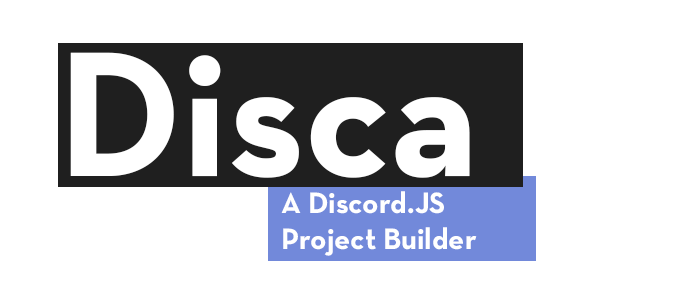

# disca

A Discord.JS Project Builder

---

## 


---

### Installation

```bash
npm i disca -g
```

---

### Usage

#### Creating A Project

```bash
disca
```

And complete the following prompts.

#### TypeScript

Disca does support TypeScript, but it requires the NPM package "typescript" to be installed globally

```bash
npm i typescript -g
```

---

### Documentation

> All Documentation Is In JavaScript

#### Client

```ts
@param config?: ClientConfig
```

#### ClientConfig

```ts
@param prefix?: string
```

#### Command Handler

```ts
@param client: Client
```

##### Basic Example

```js
const commands = new CommandHandler(client);

commands.RegisterCommand({
  name: "ping",
  aliases: [],
  permissions: {
    bot: ["SEND_MESSAGES"],
    user: [],
  },
  execute: (message, client, args) => {
    message.channel.send("Pong!");
  },
});
```

##### Advanced Example

```js
const fs = require("fs");

const commands = new CommandHandler(client);

const commandFiles = fs.readdirSync("src/Commands");

for (const file of commandFiles) {
  const command = require(`../Commands/${file}`);
  commands.RegisterCommand(command);
}
```

#### Command

```ts
@param name: string
@param aliases: string[]
@param permissions: CommandPermissions
@param execute: function(message, client, args)
```

#### CommandPermisssions

```ts
@param bot: string[]
@param user: string[]
```
